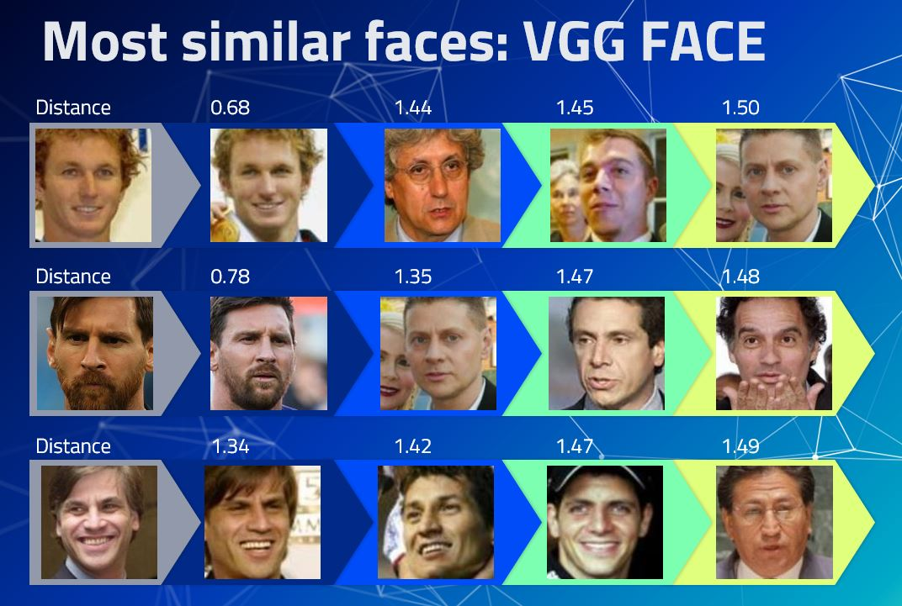

## Python version
3.8

## Model weights
https://drive.google.com/file/d/1z-bvco5AXz8fajJESLi9akr1YMGQixaa/view?usp=drive_link

## Face Recognition by Similarity Search

Our project focuses on implementing a facial recognition system based on similarity search. To accomplish this task, we leveraged a pretrained model initially trained on the VGG16 architecture using images of famous faces to predict their identities. However, since our objective was to extend this capability to recognize faces of any individual, we needed to enhance the model's generality.

To achieve this, we performed feature extraction by isolating the final classification layer of the pretrained model, thereby retaining only the feature vector. This vector encapsulates the essential characteristics of each face in a more generic manner, enabling us to compare faces across a broader spectrum.

We utilized this feature vector to compute the Euclidean distance to other faces within our dataset, allowing us to identify the most similar face to a given input. This process forms the core of our facial recognition approach, facilitating accurate identification based on facial similarities.

In our implementation, we explored the potential of pretrained models such as VGG16 and VGGFace. VGG16, a deep convolutional neural network, provides a robust foundation for feature extraction due to its ability to capture intricate patterns in images. On the other hand, VGGFace, specifically pretrained on facial images, offers enhanced capabilities for facial recognition tasks by inherently understanding facial features and variations.

By harnessing the power of these pretrained models and employing feature extraction techniques, our facial recognition system achieves a balance between accuracy and generality, making it suitable for diverse real-world applications.

